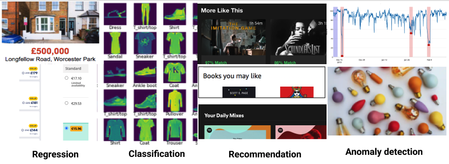
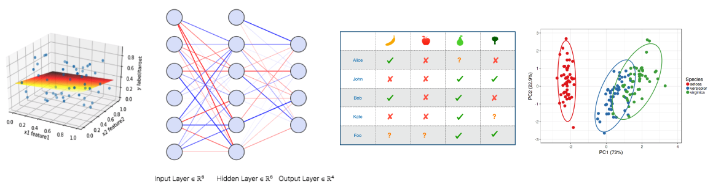
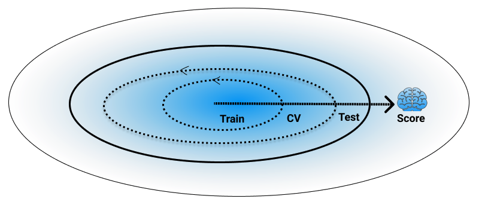
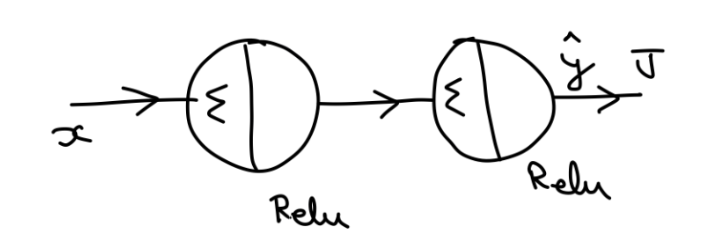

> For the things we have to learn before we can do, we learn by doing - Aristotle

# PML: Practical machine learning

Practical in a sense that problem precedes concept, you work through a problem to unravel the principle involved. This course is a collection of around 50 problems, covering fundamental areas of machine learning (ML). Focus is on foundational ML methods avoiding extremes of abstruse theory and blackbox application.

At a very high level these problems cover following functional areas

* Regression: (Predict Real Numbers)
* Classification (Predict Categories)
* Reccomendation (Similarity)
* Anomaly Detection (Not Normal)

using classical ML techniques like

* Linear regression
* Neural Networks
* Collaborative filtering
* Clustering  etc.

And simulataneously throwing light on development lifecycle of ML Application

* train
* cross-validate (CV)
* test
* score  

# Course Theme

Obviously this course is about machine learning. But apart from that there are these common problem solving themes that run throughout the course. 

## Problems

Course is completely based on problems. Each concept simple or complex is elucidated with problems. If you imagine ML101 skill as a hill to be climbed, then these problems form carved steps to that hill. Not much different from 

> You just begin. You do the math, you solve one problem. Then you solve the next one, and then the next and if you solve enough problems you get to come home - Andy Weir, The Martian

## Language 

It would help if you take this course as learning a new programming language.  If you remember your first imperative language (C++, Java, Python), You might remember their core tenets: *Expression*, *Branch*, *Loop*, *Function*, *Class*. Learning another imperative langauge would not benefit you much. But if you venture to a different paradigm and for example learned a Functional langauge (*Abstraction*, *Application*) or SQL (*Select*, *Filter*, *Group By*, *Join*) then a whole new toolbox becomes available to you. 

Similarly learning ML techniques provide you with tools to solve problems which are hard to solve by traditional programming. i.e those for which no clear recipe exist, e.g reccomending a hotel, detecting toxic content etc.  These techniques mainly deal with automating program creation by observing past or present behaviour. ([Software 2.0](https://medium.com/@karpathy/software-2-0-a64152b37c35)) But the end result is same, A program or working software. 

Just here, you *_indirectly_* arrive at that program, by letting computational power iteratively refine a coarse solution over obeserved data (_*Optimization*_) to come up with a final acceptable solution. 

## Orthogonality 
Suppose you are asked to add 2 multi dimensional vectors, you would recall adding them becomes trivial if we resolve them into their orthogonal components, then the solution is just to add up the components of same dimension. Similar concepts in software engineering like *seperation of concerns*, *divide and conquer* are used to make inroads into an otherwise tough problem. Problems in this course also follow similar structure. For e.g in a [problem](https://github.com/rawata/pml/blob/master/course/Chapter_3_Neural_Network_Workbook.pdf) to understand backpropgation algorithm, which determines how weights of neurons should be adjusted to reduce prediction error, following neural network is used.
 
This bare minimum single input, 2 layer neural network is just meant to explain the workings of backprop algorithm (forward scoring, backward weight adjustment)

# Course Duration

10 weekly classes. Each of 1.5 hour duration

# Course Prerequisites

* Showing up. (Expectation is: presence in at least 8 out of 10 classes)

* Familarity with basic programming and high school maths. One class on backpropagation will use basic concepts of differential calculus, but that can be covered from scratch in office hours.

* Best effort (upto 2 hours) on a [preWork notebook](https://github.com/rawata/pml/blob/master/assessment/PreWork.ipynb), to be submitted on course signup.

# Bonus Content

Optional 2 classes or workshops on

* ## Machine Learning on timeseries data.
* ## Deep dive into [minGPT](https://github.com/karpathy/minGPT)

